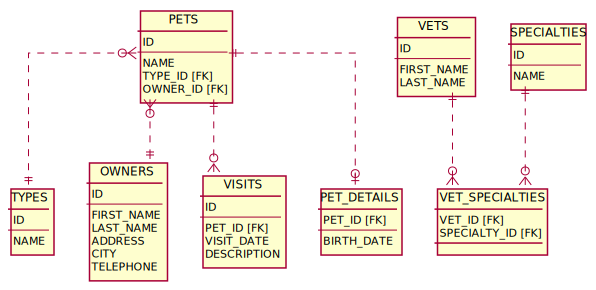

# JPA Demo

JPA のサンプルコード集

### 利用前提

- サンプルコードは Spring Boot のテストコードとして Java11 で実装しています。
- DBMS は H2 で、テスト実行時に Flyway により DDL 実行とテストデータ投入が行われます。
- SQL ログ出力向けの設定を `application.yml` と `logback.xml` で行っています。

### テストデータ

[spring-petclinic](https://github.com/spring-projects/spring-petclinic) のデータを一部改変して利用しています ([DDL](https://github.com/sooogle/jpademo/blob/main/src/main/resources/db/migration/V1__schema.sql) , [データ](https://github.com/sooogle/jpademo/blob/main/src/main/resources/db/migration/R__data.sql))

#### PETS

| ID | NAME | TYPE\_ID | OWNER\_ID |
| :--- | :--- | :--- | :--- |
| 1 | Leo | 1 | 1 |
| 2 | Basil | 6 | 2 |
| 3 | Rosy | 2 | 3 |
| 4 | Jewel | 2 | 3 |
| 5 | Iggy | 3 | 4 |
| 6 | George | 4 | 5 |
| 7 | Samantha | 1 | 6 |
| 8 | Max | 1 | 6 |
| 9 | Lucky | 5 | 7 |
| 10 | Mulligan | 2 | 8 |
| 11 | Freddy | 5 | 9 |
| 12 | Lucky | 2 | 10 |
| 13 | Sly | 1 | 10 |

#### OWNERS

| ID | FIRST\_NAME | LAST\_NAME | ADDRESS | CITY | TELEPHONE |
| :--- | :--- | :--- | :--- | :--- | :--- |
| 1 | George | Franklin | 110 W. Liberty St. | Madison | 6085551023 |
| 2 | Betty | Davis | 638 Cardinal Ave. | Sun Prairie | 6085551749 |
| 3 | Eduardo | Rodriquez | 2693 Commerce St. | McFarland | 6085558763 |
| 4 | Harold | Davis | 563 Friendly St. | Windsor | 6085553198 |
| 5 | Peter | McTavish | 2387 S. Fair Way | Madison | 6085552765 |
| 6 | Jean | Coleman | 105 N. Lake St. | Monona | 6085552654 |
| 7 | Jeff | Black | 1450 Oak Blvd. | Monona | 6085555387 |
| 8 | Maria | Escobito | 345 Maple St. | Madison | 6085557683 |
| 9 | David | Schroeder | 2749 Blackhawk Trail | Madison | 6085559435 |
| 10 | Carlos | Estaban | 2335 Independence La. | Waunakee | 6085555487 |

#### TYPES

| ID | NAME |
| :--- | :--- |
| 1 | cat |
| 2 | dog |
| 3 | lizard |
| 4 | snake |
| 5 | bird |
| 6 | hamster |

#### VISITS

| ID | PET\_ID | VISIT\_DATE | DESCRIPTION |
| :--- | :--- | :--- | :--- |
| 1 | 7 | 2013-01-01 | rabies shot |
| 2 | 8 | 2013-01-02 | rabies shot |
| 3 | 8 | 2013-01-03 | neutered |
| 4 | 7 | 2013-01-04 | spayed |

#### PET_DETAILS

| PET\_ID | BIRTH\_DATE |
| :--- | :--- |
| 1 | 2010-09-07 |
| 2 | 2012-08-06 |
| 3 | 2011-04-17 |
| 4 | 2010-03-07 |
| 5 | 2010-11-30 |
| 6 | 2010-01-20 |
| 7 | 2012-09-04 |
| 8 | 2012-09-04 |
| 9 | 2011-08-06 |

#### VETS

| ID | FIRST\_NAME | LAST\_NAME |
| :--- | :--- | :--- |
| 1 | James | Carter |
| 2 | Helen | Leary |
| 3 | Linda | Douglas |
| 4 | Rafael | Ortega |
| 5 | Henry | Stevens |
| 6 | Sharon | Jenkins |

#### SPECIALTIES

| ID | NAME |
| :--- | :--- |
| 1 | radiology |
| 2 | surgery |
| 3 | dentistry |

#### VET_SPECIALTIES

| VET\_ID | SPECIALTY\_ID |
| :--- | :--- |
| 2 | 1 |
| 3 | 2 |
| 3 | 3 |
| 4 | 2 |
| 5 | 1 |
